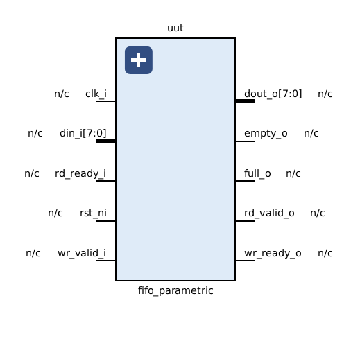
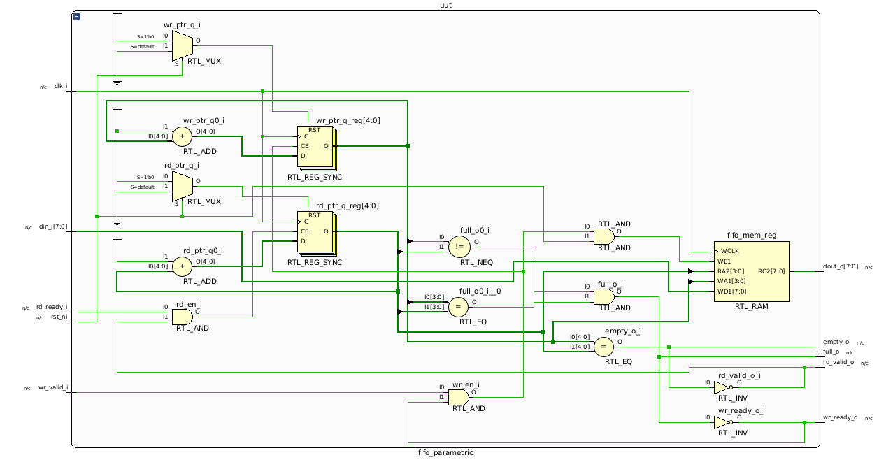
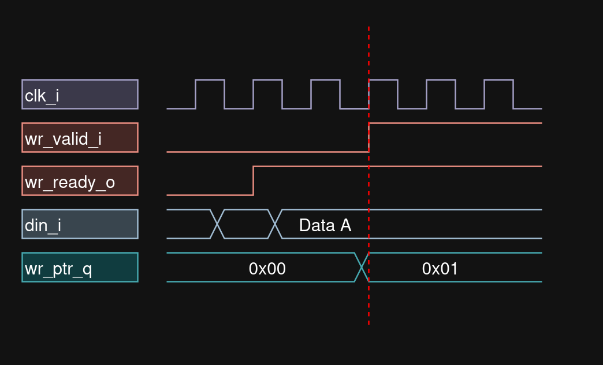
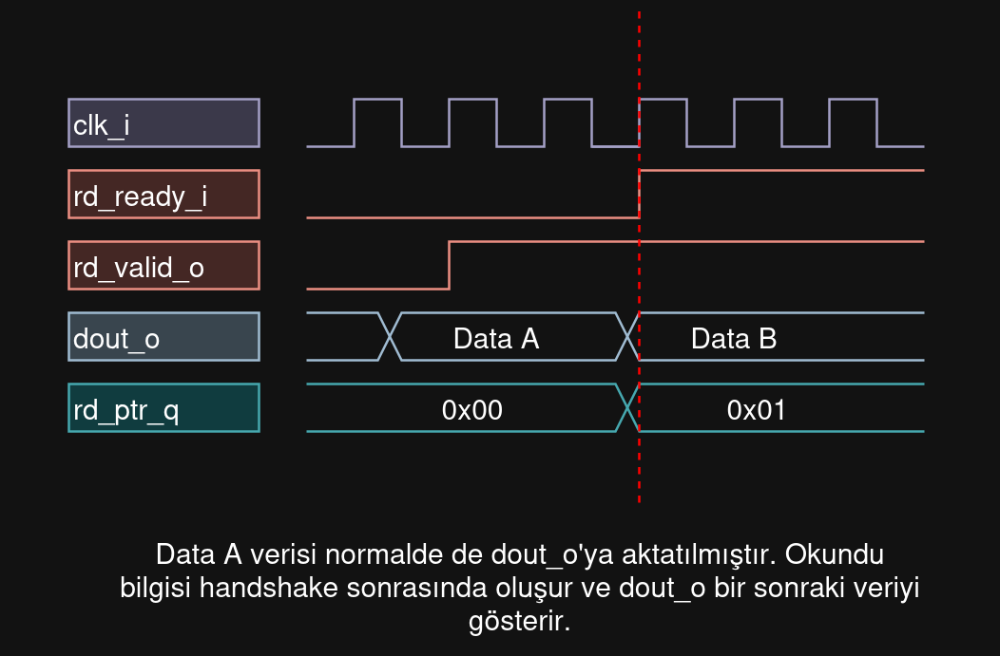
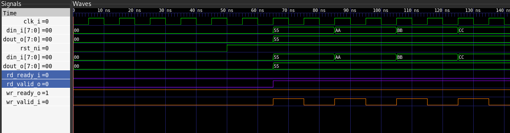
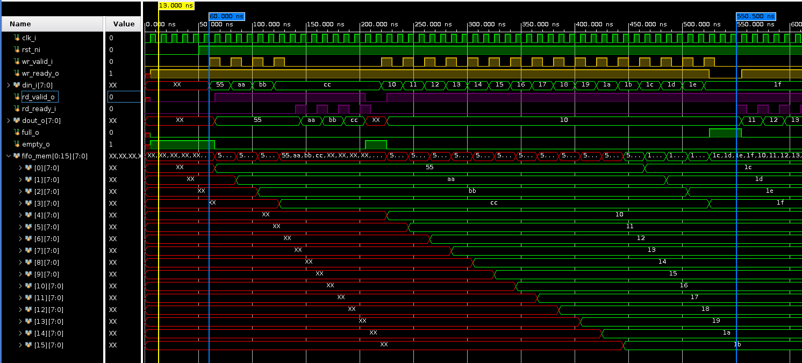
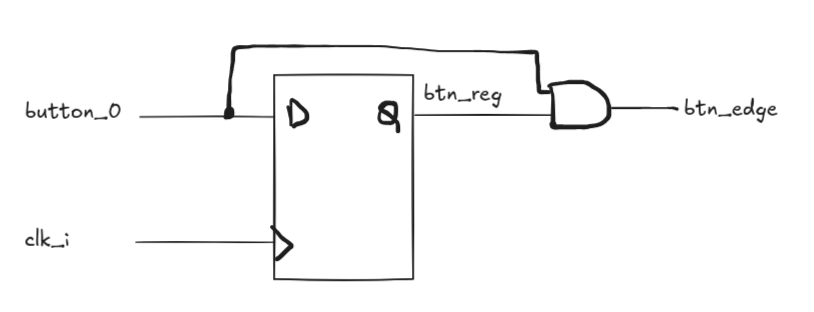
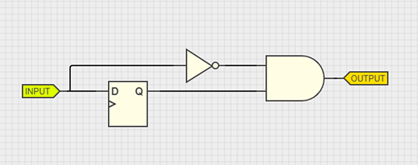

# fifo_parametric

Şematik: 






## Dökümantasyon

Parametrik ve FWFT (First-Word Fall-Through) mimarisine sahip bir FIFO birimidir.

Temel Özellikler:
- **Parametrik Yapı**: Veri genişliği (WIDTH) ve derinliği (DEPTH) ayarlanabilir.
- **FWFT Desteği**: İlk veri yazıldığı anda okuma ucunda (dout_o) hazır bekler, gecikme (latency) teorik olarak yoktur.
- **Ready-Valid Handshake**: AXI4-Stream standartlarına uyumlu el sıkışma protokolü.
- **N+1 Pointer** : Tam dolu ve tam boş durumlarını ayırt etmek için optimize edilmiş pointer yapısı.


|**Sinyal İsmi**|**Yön**|**Genişlik**|**Açıklama**|
|---|---|---|---|
|`clk_i`|Giriş|1|Sistem saat sinyali (Yükselen kenar tetiklemeli)|
|`rst_ni`|Giriş|1|Senkron aktif-düşük reset sinyali|
|**Yazma Grubu**||||
|`wr_valid_i`|Giriş|1|Yazma geçerlilik sinyali (Master veriyi sürmeye hazır)|
|`wr_ready_o`|Çıkış|1|Yazma hazır sinyali (FIFO veri alabilir - `!full`)|
|`din_i`|Giriş|`WIDTH`|FIFO giriş veri yolu|
|**Okuma Grubu**||||
|`rd_valid_o`|Çıkış|1|Okuma geçerlilik sinyali (FIFO'da veri var - `!empty`)|
|`rd_ready_i`|Giriş|1|Okuma hazır sinyali (Slave veriyi almaya hazır)|
|`dout_o`|Çıkış|`WIDTH`|FIFO çıkış veri yolu (FWFT)|
|**Durum Grubu**||||
|`full_o`|Çıkış|1|FIFO'nun tamamen dolu olduğunu belirtir|
|`empty_o`|Çıkış|1|FIFO'nun tamamen boş olduğunu belirtir|

Sinyal Durum Analizi aşağıdaki tablodaki gibidir:

| **Durum**       | **wr_ready_o** | **rd_valid_o** | **Açıklama**                                       |
| --------------- | -------------- | -------------- | -------------------------------------------------- |
| **Boş (Empty)** | 1              | 0              | Yazma yapılabilir, okuma yapılamaz.                |
| **Normal**      | 1              | 1              | Hem yazma hem okuma yapılabilir.                   |
| **Dolu (Full)** | 0              | 1              | Yazma yapılamaz (Backpressure), okuma yapılabilir. |


---


### Yazma İşlemi

FIFO'ya yazma işleminde valid ready handshake kullanılır. yazacak olan component, yazma geçerlilik sinyalini `wr_valid_i` 1 yapar. FIFO eğer uygunsa, yazmaya hazır sinyalini `wr_ready_o` 1 yapar. Her ikisi de 1 olunca clk_i sinyalinin sonraki yükselen kenarında `din_i`'deki değer FIFO'ya aktarılır.




### Okuma İşlemi

Okuma işlemi, yazma işlemine benzer şekilde Valid-Ready Handshake (El Sıkışma) mekanizmasını kullanır. Ancak bu FIFO FWFT (First-Word Fall-Through) mimarisine sahip olduğu için veri, okuma isteği gelmeden önce çıkış hattında (dout_o) hazır bekler.

**Boş FIFO:** FIFO tamamen boşsa rd_valid_o sinyali `0` olur. Bu durumda `rd_ready_i` sinyali 1 olsa dahi bir transfer gerçekleşmez ve okuma pointer'ı ilerlemez.




### Waveform

GtkWave:



Vivado:



### Debug Modu

Debug modunu aktif etmek için Makefile'daki `V_FLAGS` içinde `-DFIFO_PARAMETRIC_DEBUG` tanımlıdır. Debug çıktıları:

```verilog
`ifdef FIFO_PARAMETRIC_DEBUG
    // debug kodları
`endif
```

## Simülasyon Çıktıları

- **Dalga formu**: `sim/vcd/trace.vcd`
- **Simülasyon logu**: `sim/logs/sim.log`
- **Cocotb logu**: `sim/logs/cocotb.log`

[python cocotb kullanımı](./tb/python/README.md) readme dosyasından cocotb ile ilgili dökümanteye bakabilirsiniz.

## Kullanım Örneği

[usage.sv](./src/rtl/usage.sv) kodu ile FIFO kullanım örneğine bakabilirsiniz.




Button kullanımında edge dedect kullanılmıştır. [Buradan](https://www.google.com/url?sa=t&source=web&rct=j&url=https%3A%2F%2Fforum.digikey.com%2Ft%2Fusing-the-configurable-logic-block-clb-for-rising-and-falling-edge-detection%2F53140&ved=0CBkQjhxqFwoTCPCXnbzn0ZMDFQAAAAAdAAAAABAj&opi=89978449) daha fazla detay öğrenebilirsiniz.


CMOD A7 35T FPGA kullanılarak denenmiştir. [cmod-a7-35t-xdc](./src/fpga/cmoda7_master.xdc) dosyası ile pin atamalarına bakabilirsiniz.