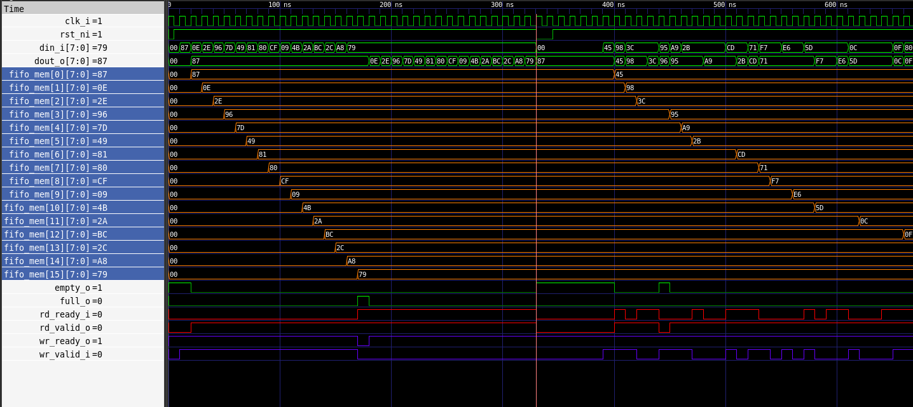

# Cocotb Kullanımı


Simülasyonu çalıştırmak için: 

```bash
make -f ../scripts/Makefile.cocotb
```


## Temel Kavramlar


1. dut Nesnesi (Device Under Test)

Test fonksiyonuna argüman olarak gelen dut, SystemVerilog modülümüzün Python'daki bir yansımasıdır.

**Değer Atama:** dut.din_i.value = 0xAA

**Değer Okuma:** val = dut.dout_o.value

2. Asenkron Yapı (async / await)

Donanım paralel çalışırken Python ardışıl çalışır. Bu farkı kapatmak için await anahtar kelimesi kullanılır:

**await RisingEdge(dut.clk_i):** Bir sonraki saat çevrimine kadar simülasyonu bekletir.

**await ReadOnly():** Simülatördeki tüm kombinasyonel hesaplamaların (assign, always_comb) bitmesini bekler. Bu fazdayken sinyallere değer atanamaz.

## Test Senaryoları

#### Senaryo 1 & 2: Sınır Kontrolleri (Full/Empty)

FIFO'nun en temel görevi, dolduğunda full_o, boşaldığında empty_o bayraklarını doğru set etmektir.

Mantık: FIFO derinliği kadar veri basılır ve bayrak kontrol edilir. Ardından tamamen boşaltılarak verinin bütünlüğü doğrulanır.

#### Senaryo 3: Gölge Model (Shadow Model) & FWFT

 Donanım ile paralel çalışan bir Python listesi (deque) tutulur.

Shadow Model: Donanıma giren her veri Python'daki listeye de eklenir. Okunan her veri listeden çıkarılarak karşılaştırılır.

FWFT (First-Word Fall-Through) Zamanlaması: Tasarımımız FWFT olduğu için veri saat kenarını beklemeden çıkışta (dout_o) hazır bekler. Bu yüzden doğrulamayı saat kenarı vurmadan hemen önce yaparız.

#### Senaryo 4: Overflow (Taşma) Koruması

Dolu bir FIFO'ya veri yazılmaya çalışıldığında, içerideki verinin bozulup bozulmadığı kontrol edilir. Donanım, full_o aktifken gelen wr_valid_i sinyalini reddetmelidir.

> ReadOnly Hatası: Eğer bir sinyale değer atarken RuntimeError: Attempting settings a value during the ReadOnly phase hatası alıyorsanız, await ReadOnly() ile sinyal ataması arasına bir await RisingEdge(dut.clk_i) koyarak zamanı ilerletmeniz gerekir.

### Waveform Çıktısı

fifo_parametric/srcipts içerisindeyken:

```bash
gtkwave dump.vcd
```
yazarak waveform'a ulaşılabilir.


